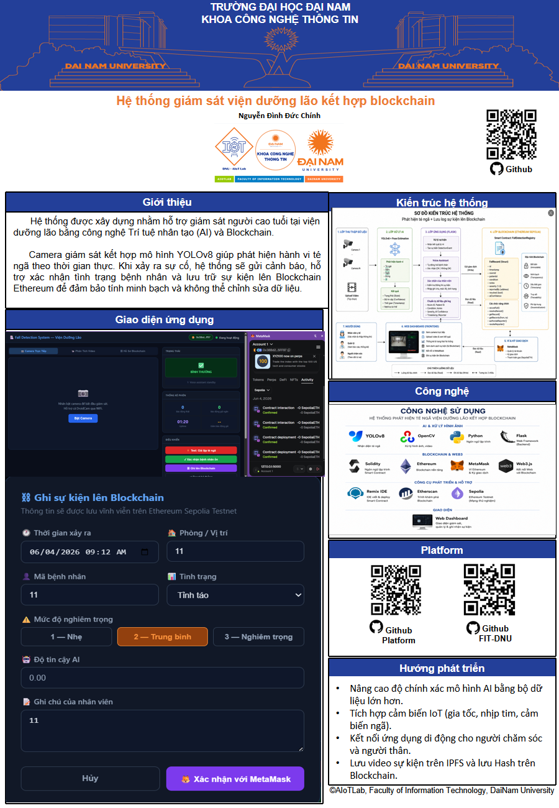

# Hệ Thống Phát Hiện Té Ngã Viện Dưỡng Lão Kết Hợp Blockchain

Hệ thống sử dụng YOLOv8 để phát hiện té ngã của người cao tuổi và Blockchain Ethereum để lưu trữ bất biến các sự kiện nhằm hỗ trợ giám sát và truy xuất dữ liệu.

## Poster Dự Án

  

## Công Nghệ Sử Dụng

- Python
- YOLOv8
- OpenCV
- Flask
- Solidity
- Ethereum
- MetaMask
- Web3.js
- Remix IDE
- Etherscan
- Sepolia Testnet

## Chức Năng Chính

- Phát hiện té ngã bằng AI
- Giám sát camera trực tiếp
- Cảnh báo sự cố thời gian thực
- Xác nhận tình trạng bệnh nhân
- Ghi sự kiện lên Blockchain
- Tra cứu lịch sử sự kiện

## Blockchain

- Smart Contract: FallDetectionRegistry
- Network: Sepolia Testnet
- Wallet: MetaMask
- Language: Solidity

## Tác Giả

DucChinh0977
